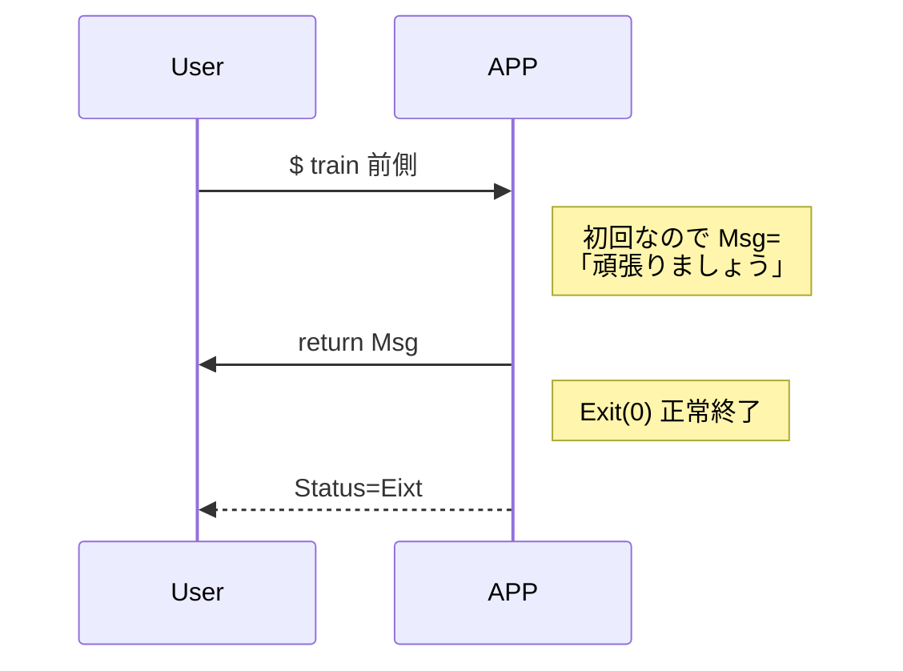
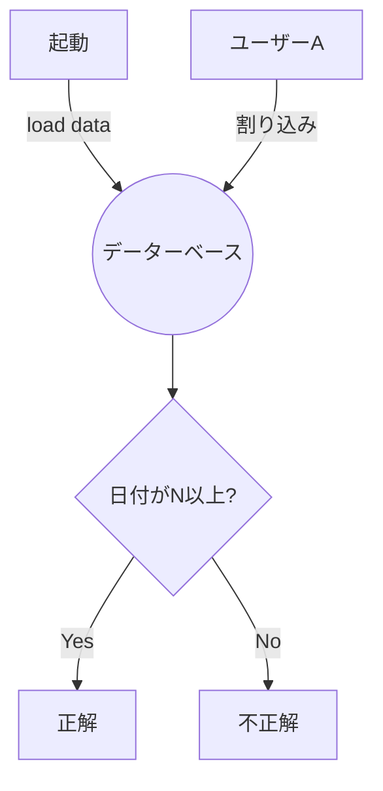

## シーケンシャル図

```mermaid
sequenceDiagram
User->> APP: $ train 前側
Note right of APP:初回なので Msg=<br>「頑張りましょう」
APP->> User: return Msg
Note right of APP: Exit(0) 正常終了
APP-->>User: Status=Eixt
```

## フロー図

```mermaid
graph TD
Start[起動] -- load data -->DB((データーベース))
A[ユーザーA] -- 割り込み --> DB
DB --> IF1{日付がN以上?}
IF1-- Yes --> OK[正解]
IF1-- No --> NG[不正解]
```

<!--stackedit_data:
eyJoaXN0b3J5IjpbMTIwNDI4MjI2OCwtMzA4ODgwOTM5LC0xOT
k5MjM1MTBdfQ==
-->