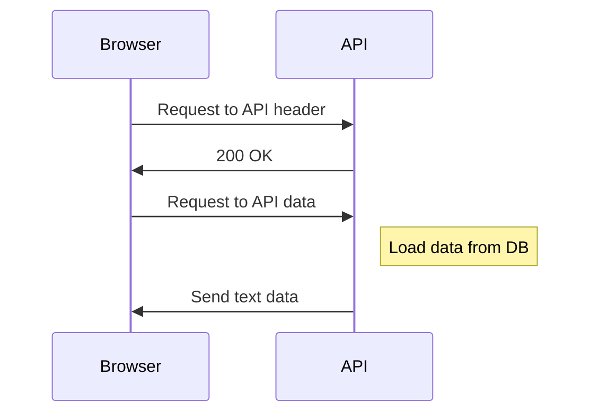

## シーケンシャル図

```mermaid
sequenceDiagram
Browser ->> API: Request to API header
API ->> Browser: 200 OK
Browser ->> API: Request to API data
Note right of API:Load data from DB
API ->> Browser: Send text data
```

## フロー図

```mermaid
sequenceDiagram
```

<!--stackedit_data:
eyJoaXN0b3J5IjpbLTcyNDUxMjk1NSwtMTk5OTIzNTEwXX0=
-->