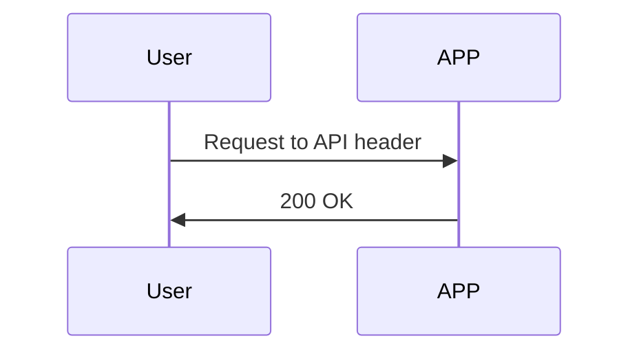
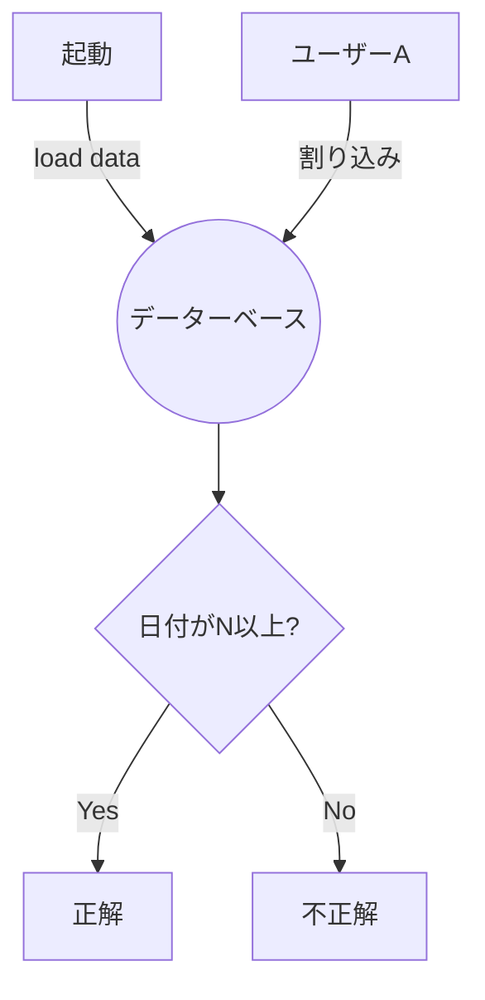

## シーケンシャル図

```mermaid
sequenceDiagram
User->> APP: Request to API header
APP->> User: 200 OK

```

## フロー図

```mermaid
graph TD
Start[起動] -- load data -->DB((データーベース))
A[ユーザーA] -- 割り込み --> DB
DB --> IF1{日付がN以上?}
IF1-- Yes --> OK[正解]
IF1-- No --> NG[不正解]
```

<!--stackedit_data:
eyJoaXN0b3J5IjpbMTQ1Mzg2NzYxOSwtMzA4ODgwOTM5LC0xOT
k5MjM1MTBdfQ==
-->