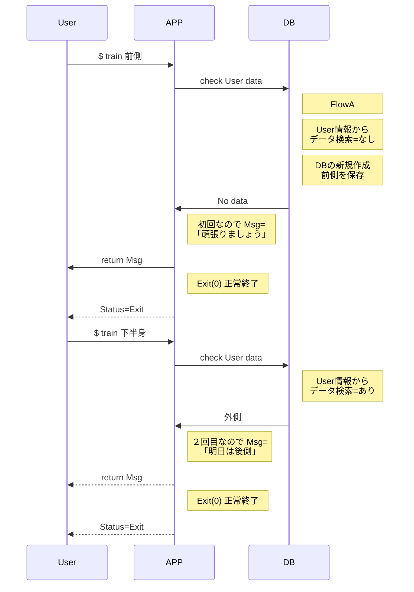

## シーケンシャル図



## フロー図

```mermaid
graph TD
Start[FlowA 体重判定] -- input data --> IF2{
DB((データーベース))
DB --> IF1{日付がN以上?}
IF1-- Yes --> OK[正解]
IF1-- No --> NG[不正解]
```

<!--stackedit_data:
eyJoaXN0b3J5IjpbMTc4NzMwOTc4OSwtNzI2NDU5NjA1LC0zMD
g4ODA5MzksLTE5OTkyMzUxMF19
-->