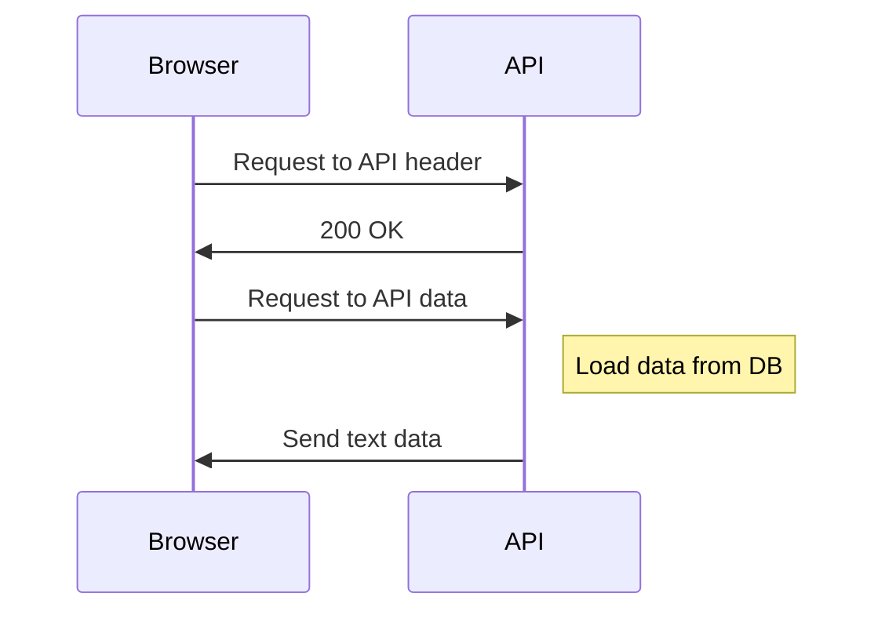

# フロー図

> Written with [StackEdit](https://stackedit.io/).

```mermaid
sequenceDiagram
Browser ->> API: Request to API header
API ->> Browser: 200 OK
Browser ->> API: Request to API data
Note right of API:Load data from DB
API ->> Browser: Send text data
```

<!--stackedit_data:
eyJoaXN0b3J5IjpbMTI5MDU1MzM4OF19
-->