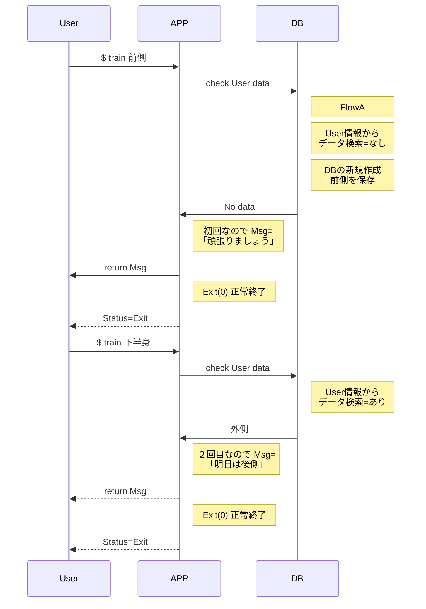
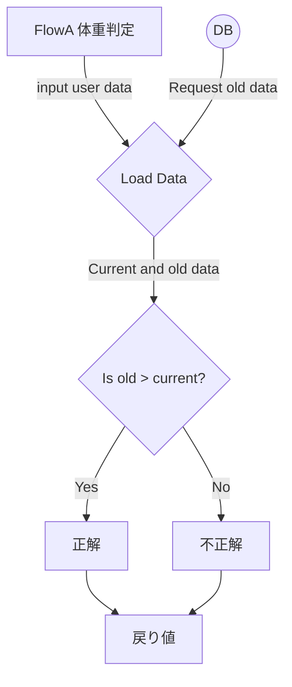

## シーケンシャル図

```mermaid
sequenceDiagram
User->> APP: $ train 前側
APP ->> DB: check User data
Note right of DB: FlowA
Note right of DB:User情報から<br>データ検索=なし
Note right of DB:DBの新規作成<br>前側を保存
DB ->> APP: No data
Note right of APP:初回なので Msg=<br>「頑張りましょう」
APP ->> User: return Msg
Note right of APP: Exit(0) 正常終了
APP -->>User: Status=Exit
User ->> APP: $ train 下半身
APP ->> DB: check User data
Note right of DB:User情報から<br>データ検索=あり
DB ->> APP: 外側
Note right of APP:２回目なので Msg=<br>「明日は後側」
APP -->> User: return Msg
Note right of APP: Exit(0) 正常終了
APP -->>User: Status=Exit
```

## フロー図

```mermaid
graph TD
Start[FlowA 体重判定] -- input user data --> LoadData{Load Data}
DB((DB)) -- Request old data --> LoadData
LoadData -- Current and old data --> IF1{Is old > current?}
IF1-- Yes --> OK[正解]
IF1-- No --> NG[不正解]
OK --> End[戻り値]
NG --> End
```

<!--stackedit_data:
eyJoaXN0b3J5IjpbLTE5NDAyNDc4MDEsLTcyNjQ1OTYwNSwtMz
A4ODgwOTM5LC0xOTk5MjM1MTBdfQ==
-->