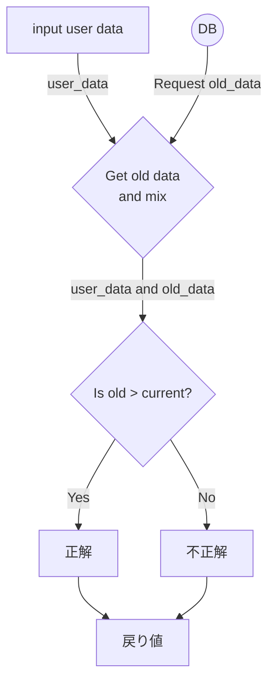

## シーケンシャル図

## フロー図

引数を返す（表示するだけのもの）
// 引数を確認
// 引数を表示
// 終了

def sample( user_data ) のフロー図

<!--stackedit_data:
eyJoaXN0b3J5IjpbLTE3Mjc0MjY0MDMsMTUzNzYzMDYzNiwtNz
I2NDU5NjA1LC0zMDg4ODA5MzksLTE5OTkyMzUxMF19
-->